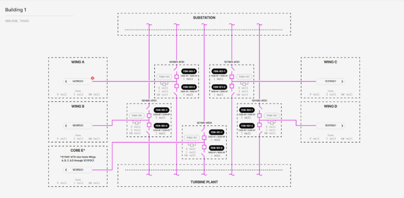

# 3.2.2.1 Building Overview/ Medium Voltage Auto Transfer Switches (MV-ATS) Onelines

**Description**: View shows the status (energized vs. deenergized) of the electrical connections from the onsite Substation and Turbine Plant to the five MV-ATSes, as well as the status of the electrical connections from those ATSes to their respective wings. Each MV-ATS has two SEL-751A feeder protection relays (one on each source) and one currently out-of-scope power quality monitor (PQM). Realtime voltage (V), current (I), and power (kW) totals are shown for each wing, as well as a navigation link to that wing’s PDC.