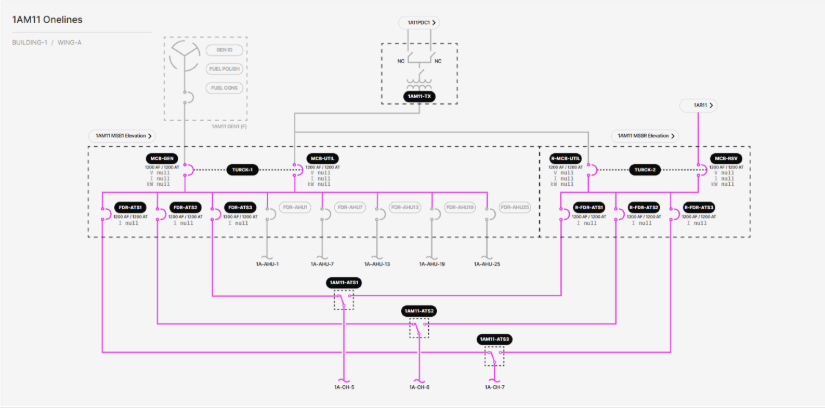

# 3.2.2.4 Chiller Power/Mechanical Main Switchboard (MSB) Onelines

**Description**: View shows the status (energized vs. deenergized) of the electrical connections to a Chiller Power MSB from its respective TX, as well as the status of the electrical connections from the MSB to its various loads. The MSB is split into a main side and a reserve power side with a navigation link to the reserve power MSB. Each Chiller Power MSB has 4 ABB E6.2 main breakers, 6 ABB XT7 feeder breakers, 5 unmonitored ABB XT2 feeder breakers, and 2 Turck TX705 controllers acting as logical ATSes between the main breaker transfer pairs. The MSB’s loads are 3 ABB TruONE chiller ATSes. 