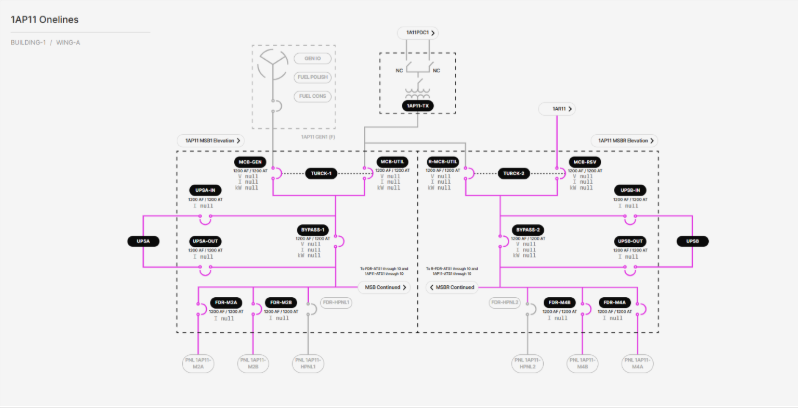

# 3.2.2.5 Control & Pump Main Switchboard (MSB) Onelines

**Description**: View shows the status (energized vs. deenergized) of the electrical connections to a Control & Pump MSB from its respective TX, as well as the status of the electrical connections from the MSB to its various loads. The MSB is split into a main side and a reserve power side with a navigation link to the reserve power MSB. Each Control & Pump MSB has 4 ABB E6.2 main breakers, 2 ABB E2.2 UPS bypass breakers, 4 ABB E2.2 UPS breakers, 4 ABB XT7 feeder breakers, 2 Galaxy VX UPSes, 2 Turck TX705 controllers acting as logical ATSes between the main breaker transfer pairs, and 20 breakers and 20 ATSes shown on a “continued” view with a navigation link to that view. The MSB’s loads are unmonitored panelboards.  