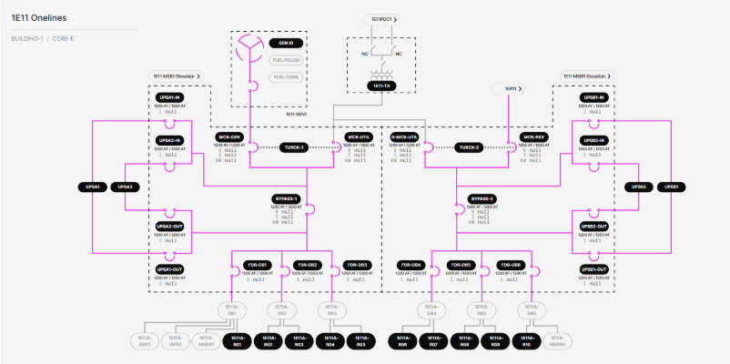

# 3.2.2.10 Core IT Distribution Switchboard (MSB) Onelines

**Description**: View shows the status (energized vs. deenergized) of the electrical connections to a Core IT Distribution MSB from its respective TX, as well as the status of the electrical connections from the MSB to its various loads. Each Core IT Distribution MSB has 4 ABB E6.2 main breakers, 2 ABB E6.2 UPS bypass breakers, 4 ABB E2.2 UPS breakers, 8 ABB XT7 feeder breakers, 4 UPSes, and 2 Turck TX705 controllers acting as logical ATSes between the main breaker transfer pairs. The MSB’s loads are 6 distribution panelboards (DBs) feeding various remote power panels (RPPs) and IDFs. 
