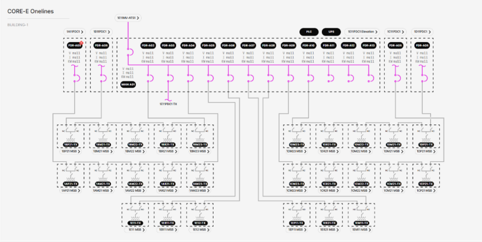

# 3.2.2.3 Core Power Distribution Center (PDC) Onelines

**Description**: View shows the status (energized vs. deenergized) of the electrical connections from the Core MV-ATS to the Core PDC, as well as the status of the electrical connections from the PDC to its medium voltage transformer (TX) loops. Also shown is one breaker from each Wing PDC to the TX loops they redundantly feed and a navigation link to those PDCs. The Core PDC has 13 REF615L feeder protection relays, a PLC, a UPS, and a navigation link to an elevation view of the PDC skid. Each TX has an ioLogik E1210 IO gateway showing alarm contact statuses and a navigation link to the MSB it feeds. 