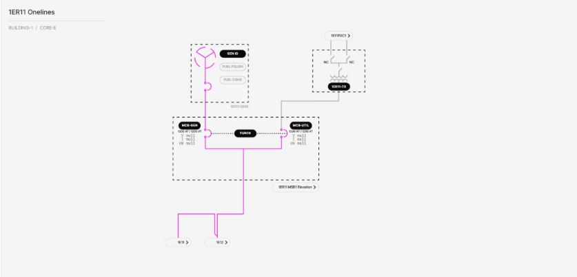

# 3.2.2.8 Core Reserve Power Main Switchboard (MSB) Onelines

**Description**: View shows the status (energized vs. deenergized) of the electrical connections to the Core Reserve Power MSB from its respective TX, as well as the status of the electrical connections from the MSB to its various loads. The MSB feeds the reserve power side of the two Core IT Distribution MSBs and has a navigation link to those MSBs. Each Core Reserve Power MSB has 2 ABB E6.2 main breakers and 1 Turck TX705 controllers acting as a logical ATS between the main breaker transfer pair. 