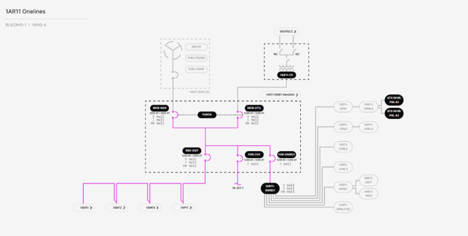

# 3.2.2.7 Reserve Power Main Swtichboard (MSB) Onelines

**Description**: View shows the status (energized vs. deenergized) of the electrical connections to a Reserve Power MSB from its respective TX, as well as the status of the electrical connections from the MSB to its various loads. The MSB feeds the reserve power side of several Chiller Power and Control & Pump MSBs and has a navigation link to those MSBs. Each Reserve Power MSB has 2 ABB E6.2 main breakers, 1 ABB E6.2 output breaker, 2 ABB XT7 feeder breakers, and 1 Turck TX705 controllers acting as a logical ATS between the main breaker transfer pair. The MSB’s loads are a single chiller and a house loads switchboard (SWBD). 