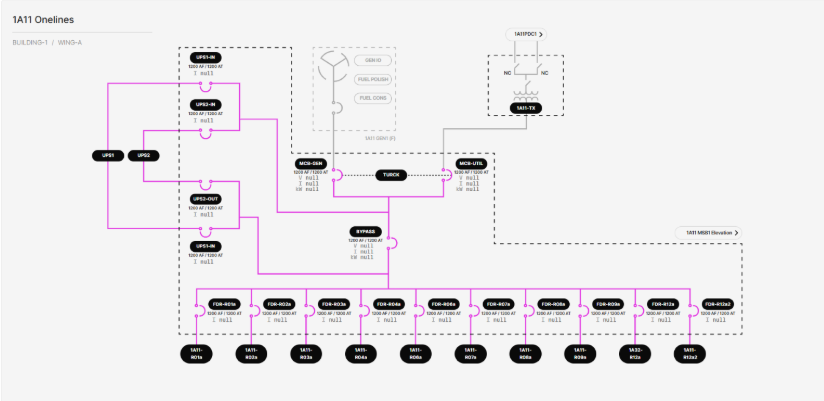

# 3.2.2.9 Wing IT Distribution Main Switchboard (MSB) Onelines

**Description**: View shows the status (energized vs. deenergized) of the electrical connections to a Wing IT Distribution MSB from its respective TX, as well as the status of the electrical connections from the MSB to its various loads. Each Wing IT Distribution MSB has 2 ABB E6.2 main breakers, 1 ABB E6.2 UPS bypass breaker, 2 ABB E4.2 UPS breakers, 10 ABB XT7 feeder breakers, 2 UPSes, and 1 Turck TX705 controller acting as a logical ATS between the main breaker transfer pair. The MSB’s loads are up to 10 remote power panels (RPPs) and an occasional distribution panelboard (DB). 