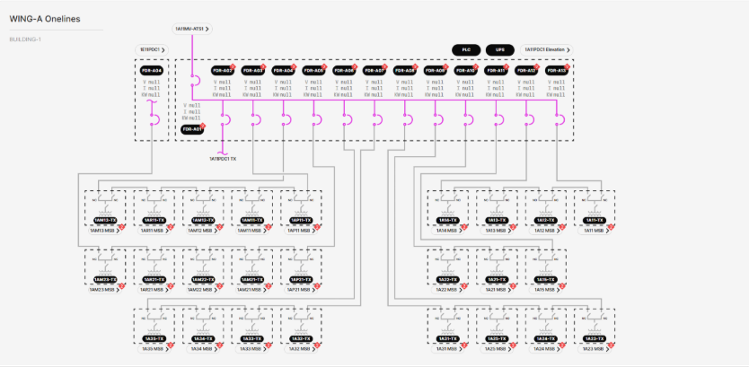

# 3.2.2.2 Wing Power Distribution Center (PDC) Onelines

**Description**: View shows the status (energized vs. deenergized) of the electrical connections from the wing’s MV-ATS to its PDC, as well as the status of the electrical connections from the PDC to its medium voltage transformer (TX) loops. Also shown is the Core PDC breaker that redundantly feeds one of the TX loops and a navigation link to the Core PDC. The Wing PDC has 13 REF615L feeder protection relays, a PLC, a UPS, and a navigation link to an elevation view of the PDC skid. Each TX has an ioLogik E1210 IO gateway showing alarm contact statuses and a navigation link to the MSB it feeds. 